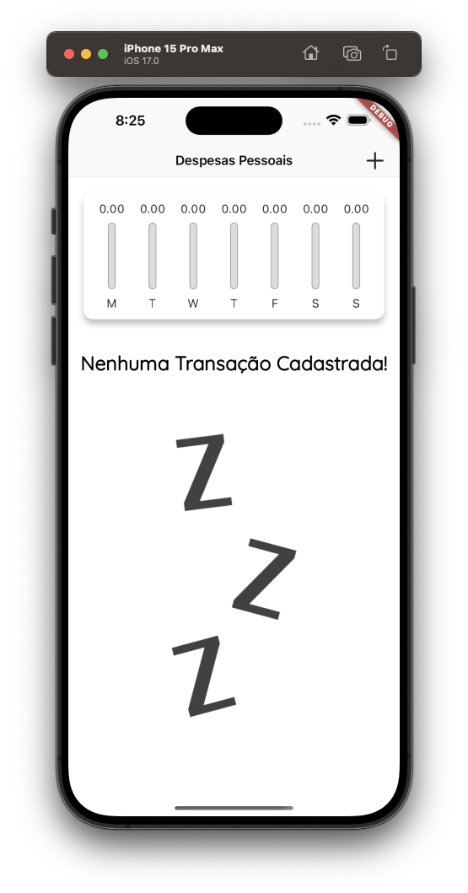
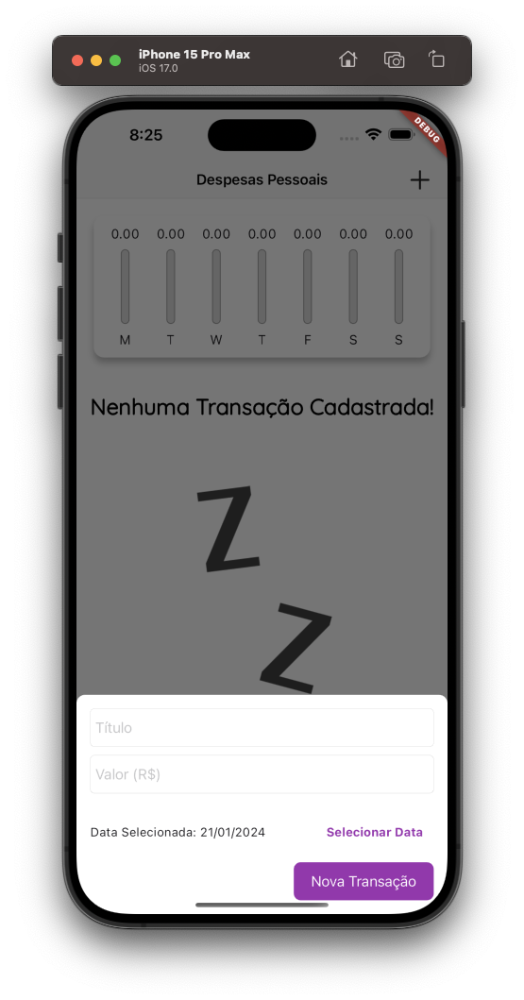
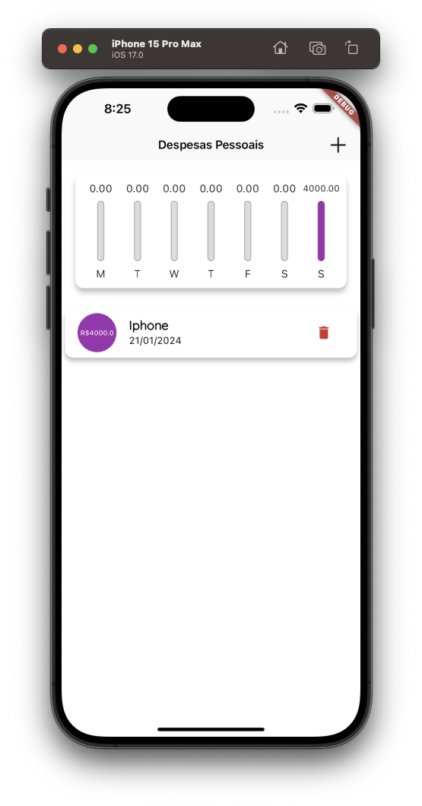

---

## Expenses App

---

<div align="center">

**Language:**

[](README.md)
[](README.pt-br.md)

</div>

---
## ℹ️ Sobre este repositório
O objetivo principal deste repositório é demonstrar o aplicativo desenvolvido para treinar meus conhecimentos durante o curso de Flutter da empresa [COD3R](https://www.udemy.com/course/curso-flutter/).

---
## ⚙️ Funcionalidades
Este app tem as seguintes funcionalidades:

- Gerenciar finanças gastas (criar, ler, atualizar e excluir).
- Exibir ao usuário quanto foi gasto em uma semana.
- Exiba estatísticas financeiras por meio de gráficos.
- Exibir um layout responsivo independente da tela do dispositivo.

---
## 👁️ Pré-visualização
<h1 align="center">

</h1>

<h1 align="center">
    
    
    
</h1>

---
## 📝 Notas
Como já trabalho com desenvolvimento de aplicações mobile, fiz algumas alterações durante o curso.
Durante o curso, o professor baixou as fontes diretamente do site [fonts.google.com](https://fonts.google.com/).
Porém, atualmente no Flutter existe um pacote que já traz essas fontes diretamente do Google.
Então eu apenas importei o pacote [google_fonts](https://pub.dev/packages/google_fonts) e usei as fontes que ele fornece.

---
## 🧪 Tecnologias
Este projeto foi desenvolvido utilizando as seguintes tecnologias:

- [Flutter (v3.16.0)](https://docs.flutter.dev/)
- [Dart (v3.2.0)](https://dart.dev/)
- [Intl](https://pub.dev/packages/intl)
- [Google_Fonts](https://pub.dev/packages/google_fonts)

---
## ⚡ Instalação

Primeiramente clone este projeto usando:

```bash
  git clone https://github.com/GoedertDalmolin/expenses.git
  cd expenses
```

Por fim, com o flutter instalado em sua máquina, execute o seguinte comando:

```bash
  flutter run
```

---
</> Desenvolvido por [GoedertDalmolin](https://github.com/GoedertDalmolin) 👋
---
